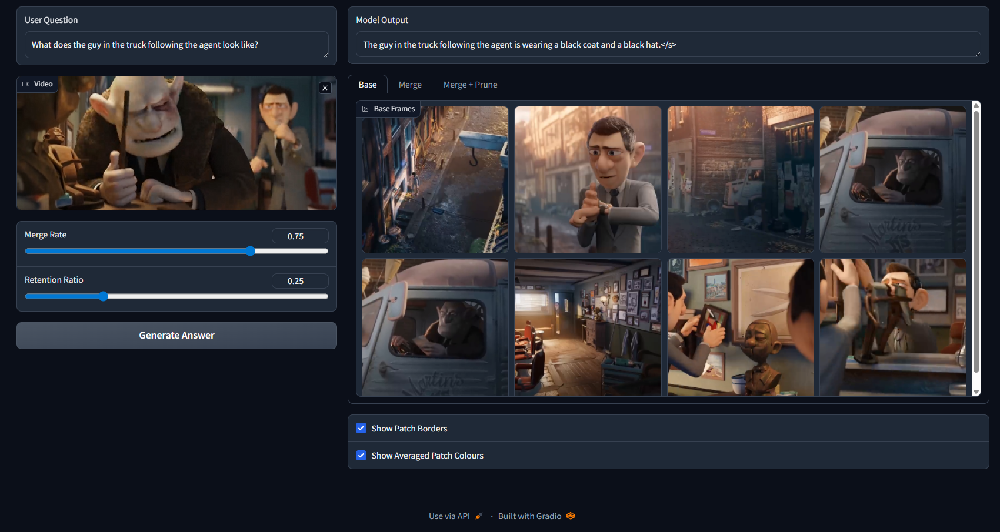

## Project Overview
Vision Language Models (VLMs) have shown strong performance across various applications. However, processing videos requires significantly more tokens compared to text and images, leading to considerable computational overhead. As a result, deployment in latency-critical and resource-constrained environments is impractical, limiting wider adoption. The computational cost increases quadratically with token count, therefore compression methods that reduce the token count can yield substantial cuts in inference latency and memory consumption.

This project proposes a training-free and plug-and-play compression pipeline composed of two main components: the Keyframe Selector, which selects frames relevant to the input query, and the Compression Module, which applies token-level compression to discard redundant tokens within frames. 

## About This Repository
This repository is a fork of [Video-LLaVA](https://github.com/PKU-YuanGroup/Video-LLaVA) by PKU-YuanGroup. This fork extends the model with a plug-and-play compression pipeline.

### Added Files
**`videollava/model/compressor/` - The Compression pipeline**

| File | Description                                                                                  |
|---|----------------------------------------------------------------------------------------------|
| `keyframe_selector.py` | Query-aware Keyframe Selector module, and the Video Segmenter and Clip Selector sub-modules. |
| `compression_module.py` | The Compression Module, and the Merger (BSM) and Pruner (CLS-attention pruning) sub-modules. |
| `llava_compressed.py` | The LLaVA specific implementation of the Keyframe Selector and Compression Module classes.   |

**`videollava/eval/video/` - Evaluation scripts**

| File                         | Description                                        |
|------------------------------|----------------------------------------------------|
| `run_inference_video_mme.py` | Video-MME benchmark inference script.              |
| `eval_qa_videomme.py`        | Video-MME benchmark evaluation script.             |
| `monitor_module.py`          | Monitoring Module for recording inference latency. |

**Other**

| File                  | Description                                                                 |
|-----------------------|-----------------------------------------------------------------------------|
| `gradio_demo.py`      | Interactive web demo for visualising each step of the compression pipeline. |
| `scripts/v1_5/eval/run_qa_*.sh` | SLURM job scripts for benchmark inference and evaluation                    |


## Requirements and Installation
The following is an instruction on how to setup the Linux environment for the project:
* Python >= 3.10
* Pytorch == 2.0.1
* CUDA Version >= 11.7
* Install required packages:
```bash
git clone https://github.com/PKU-YuanGroup/Video-LLaVA
cd Video-LLaVA
conda create -n videollava python=3.10 -y
conda activate videollava
pip install --upgrade pip  # enable PEP 660 support
pip install -e .
pip install -e ".[train]"
pip install flash-attn --no-build-isolation
pip install decord opencv-python git+https://github.com/facebookresearch/pytorchvideo.git@28fe037d212663c6a24f373b94cc5d478c8c1a1d
```
## Gradio Web Demo
The model weights have to be downloaded the first time the model is ran, therefore it might take several minutes.
```bash
python gradio_demo.py
```
